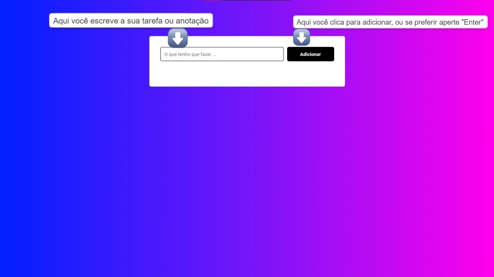
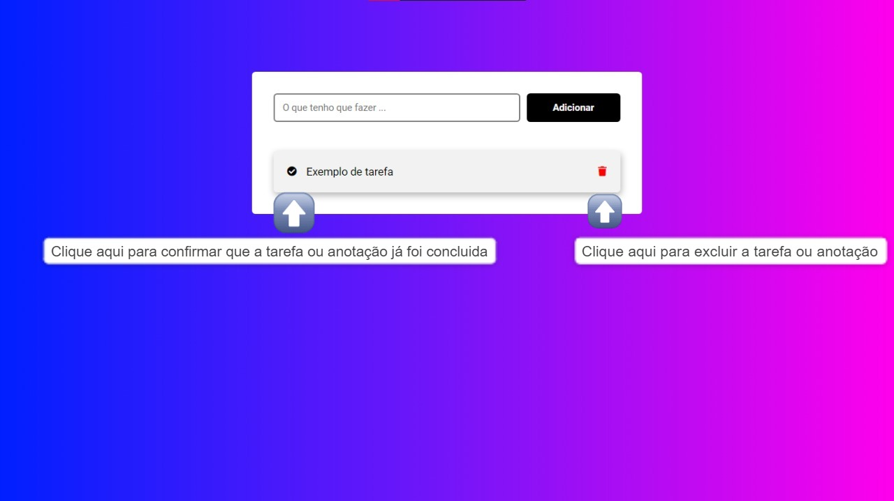
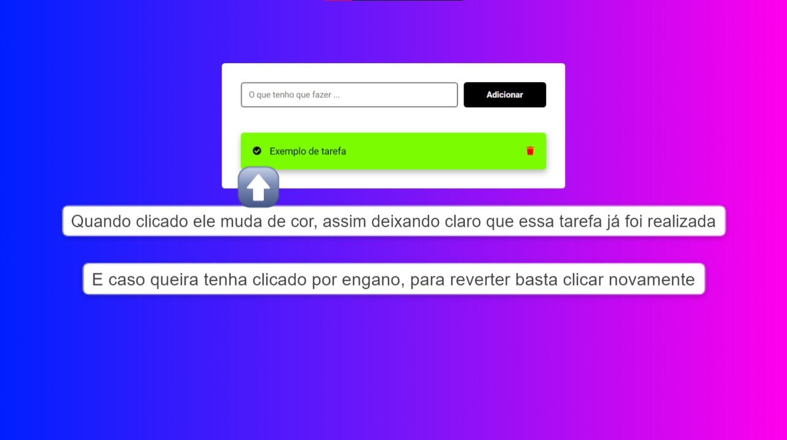

# Lista de Tarefas
Essa é uma lista de tarefas ( Funcional ), caso queira usar, o link está abaixo.

>Resultado do projeto: Lista de Tarefas.
## 📋 Descrição

Essa é uma lista de tarefas ( Funcional ), ao restaurar a página os itens adicionados continuam nela sem alteração, ele só será excluído caso vc o exclua.

## 📜 Skills Utilizadas

<code></code> <code></code> <code></code>

## Link para testar o Convertor

Link: (https://francolenner.github.io/Lista-de-Tarefas/)

## 👋 Feito por
<table>
  <tr>
    <td align="center">
      <a href="https://www.linkedin.com/in/franco-lenner-5622b7195/">
         
        
          <b>Franco Lenner</b>
        
      </a>
    </td>
  </tr>
</table>